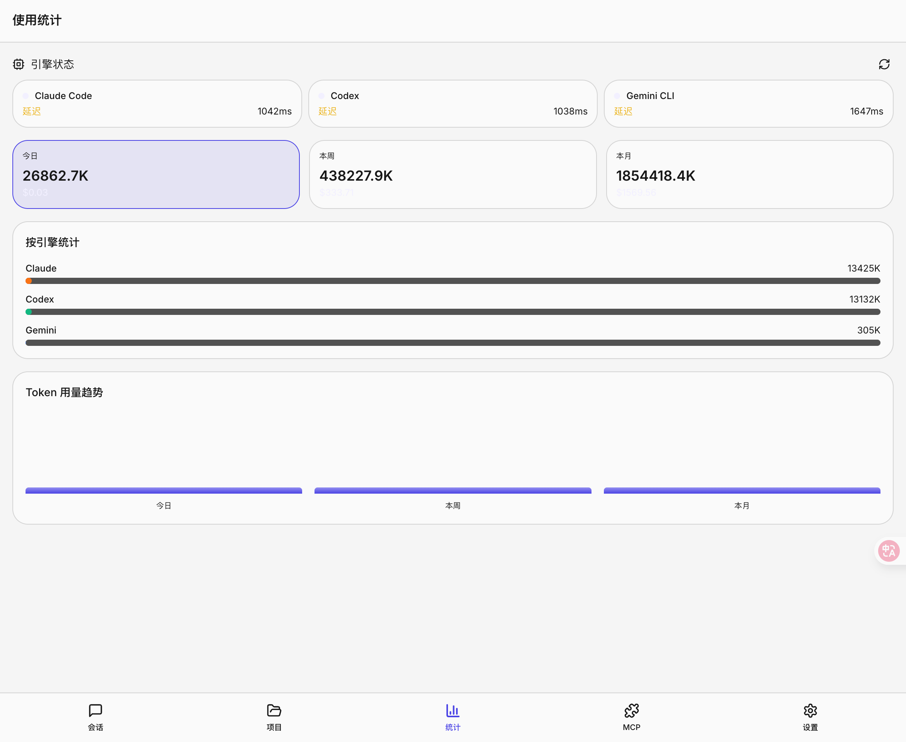

  
  <h1>Ling Guang</h1>

  

    <b>English</b> | <a href="README.md">中文</a>
  

A mobile-ready web client for interacting with multiple AI CLIs (Claude Code, Codex, and Gemini). It offers a chat interface to manage sessions and projects, plus usage statistics.

## Key Features

- **Multi-model support**: Seamless switching between Claude, Codex, Gemini, and more.
- **Mobile-first design**: Fully responsive UI for desktop and mobile.
- **Real-time chat**: Interactive chat with Markdown rendering and code highlighting.
- **Session and project management**: Organize chats by session and link them to projects.
- **Usage analytics**: Track token usage and view real-time engine status.
- **Plugin system**: Extend core capabilities with custom plugins.
- **Prompt management**: Create, edit, and manage system prompts to shape AI behavior.

## Table of Contents

- [Overview](#overview)
- [Core Capabilities](#core-capabilities)
- [Architecture](#architecture)
- [Screenshot](#screenshot)
- [Quick Start](#quick-start)
- [Docs](#docs)
- [License](#license)

## Overview

Ling Guang is a web platform built for AI-driven development workflows, with unified multi-engine access and switching. It provides a controlled, trackable, and extensible experience for individuals and teams, with mobile-friendly access. A Feishu chatbot entry point is planned.

## Core Capabilities

- Multi-engine support: unified management for Claude, Codex, and Gemini
- Project management: organize and search projects/sessions
- Session control: context handling, permissions, and directives
- Cost tracking: usage analytics and cost insights
- Intelligent translation: bilingual workflows with term consistency
- Extensibility: plugins/skills system
- Multi-device ready: desktop and mobile-friendly
- Bot integration: Feishu chatbot (planned)

## Architecture

Ling Guang uses a decoupled frontend/backend architecture with an engine orchestration layer:

- Web UI: visual operations and multi-device layout
- Backend services: APIs, sessions/projects, cost tracking, translation, and plugins
- Engine adapters: integrations for Claude, Codex, and Gemini CLI/SDK
- Extension layer: plugins/skills registration, configuration, and permissions

Data flow:

1. Users create projects/sessions in the UI
2. Backend aggregates context and routes requests to the selected engine
3. Engine responses are stored with usage stats
4. UI renders outputs and supports iterative workflows

## Screenshot

## Quick Start

Read the subproject docs first:

- Frontend: [code-companion/README.md](code-companion/README.md)
- Backend: [backend/README.md](backend/README.md)

## Docs

- Frontend docs: [code-companion/README.md](code-companion/README.md) (ready for customization and secondary development)
- Backend docs: [backend/README.md](backend/README.md) (ready for customization and secondary development)

## License

This project is licensed under the MIT License. See `LICENSE`.
